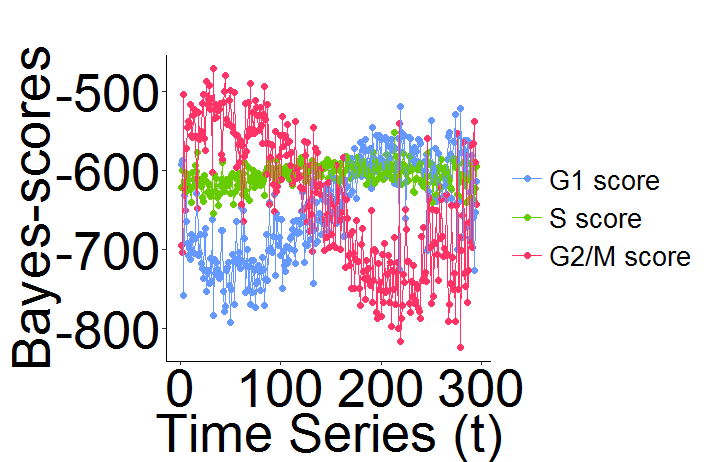
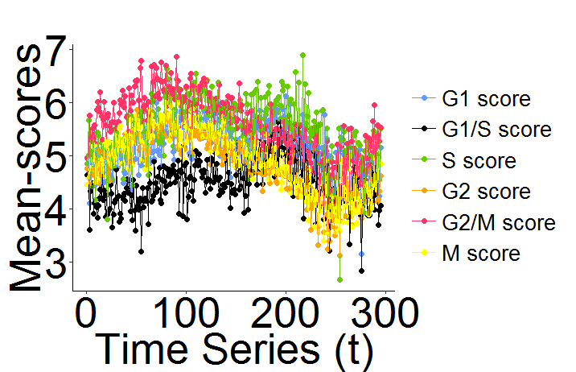
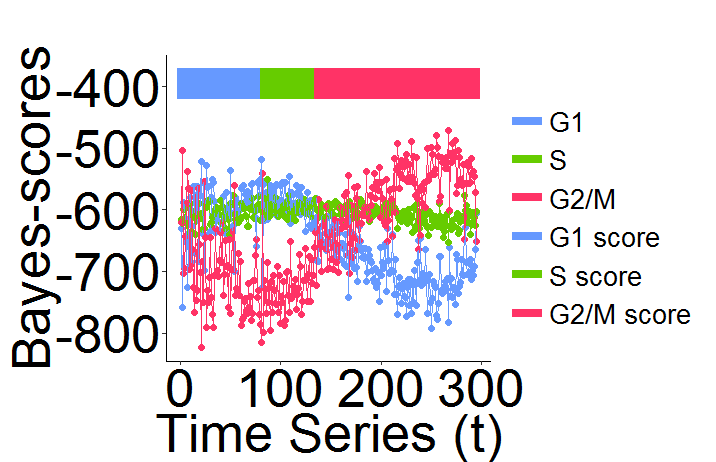
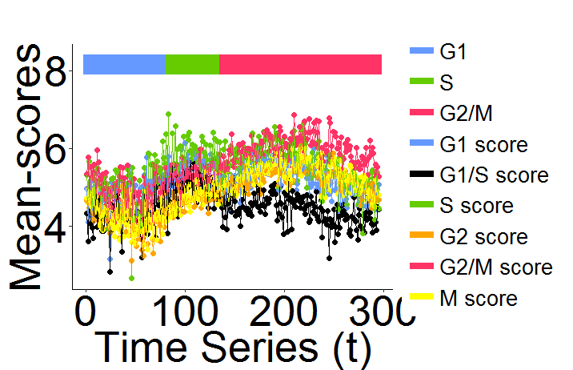

## What is reCAT?

reCAT is a modelling framework for unsynchronized single-cell transcriptome data that can reconstruct a high-resolution cell cycle time-series. It is mainly based on traveling salesman problem (TSP), Gaussian mixture model (GMM) and hidden Markov model (HMM). We developed an R based software package which is easy to use. The performance is relatively accurate and stable. Thanks for using!

Software by Zehua Liu, Huazhe Lou and Hao Wang. reCAT is explained in more detail in the accompanying publication:

###### Liu, Z., Lou, H., Xie, K., Wang, H., Chen, N., Aparicio, O.M., Zhang, M.Q., Jiang, R. and Chen, T., 2017. Reconstructing cell cycle pseudo time-series via single-cell transcriptome data. Nature communications, 8(1), pp.1-9.

## Intuition

Two fundamental assumptions underlie the reCAT approach: that 1) different cell cycle phases form a cycle, and 2) the change of transcriptome profile from one phase to the next should be monotonic, increasing with time span widths. 

## Installation

## How to use

reCAT is implemented in R and is easy to use. There are some test data in /data, and we use ola_mES_2i.RData as an example. The data will be loaded automatically when loading the R package.

#### 1. Preparatory work

Required packages:

***ggplot2***

***doParallel***

***mclust***

***cluster***

***TSP***
Installation of reCAT:

	require(devtools)
	setwd("where reCAT folder is located")
	install("reCAT", args = c("--no-multiarch"))
	library(reCAT)

	# Sample code and parameter usage can also be accessed using ?reCAT.

#### 2. Data preprocessing

in reCAT, the value in test_exp should be log2(TPM+1), and then you can use ***get_test_exp*** function to get standard input data

	library(reCAT)
	test_exp <- get_test_exp(t(test_exp))

in test_exp, there are only cycle base gene's value, we just do a filter on the original data, so that the data is easy to handle in following steps

#### 3. Get order (please see * for additional parameters)

When you preprocessing your test data, you can get its order(cell's time series) easily with ***get_ordIndex*** function. In this function, there are two parameters, one is the input data, the other is thread number, the threaad number depends on the number of cores. So maybe you can choose a large thread number like 20 to speed it up when you run it on a server.

for example:

	ordIndex <- get_ordIndex(test_exp, threadnum = 8, step_size = 2)

#### 4. Get bayes-score and mean-score
In reCAT, there are two scores, bayes score and mean score, you can easily get both when you use ***get_score*** function.

for example:

	score_result <- get_score(t(test_exp))

you can use the following two orders to view the two scores

	score_result$bayes_score
	score_result$mean_score

#### 5. Plot1
Now you have the scores and time series (ordIndex you from previous step), you can draw the scores along the time series using the ***plot_bayes*** and ***plot_mean*** functions

	plot_bayes(score_result$bayes_score, ordIndex)
	plot_mean(score_result$mean_score, ordIndex)

the result is like follows:

#### 6. HMM
Now you have the scores and time series, but you don't know whether the cell is G1 or S or G2/M. In this case, you can use the ***get_hmm_order*** function
to sort the cells.

In this function, there are six parameters: bayes_score, mean_score and ordIndex (obtained above). cls_num is the desired number of class, generally 3 implies (G1, S, G2/M) and 4 implies (G0, G1, S, G2/M). myord is the real time series that you can re-order, for example, if you choose 4 to be the start, then the real order is c(4:1, 295:5). rdata is the class region that you evaluate from the bayes_plot and mean_plot. For example, in ola_mES_2i, we can easily determine that cells in c(210:230) is G1, cells in c(40:60) is G2/M, and cells in c(170:190) is S, so the rdata is: 

		start	end
	1	210		230
	2	170		190
	3	40		60

for example:
	
	myord = c(4:1, 295:5)
	hmm_result <- get_hmm_order(bayes_score = score_result$bayes_score, 
		mean_score = score_result$mean_score, 
		ordIndex = ordIndex, cls_num = 3, myord = myord, rdata = rdata)

#### 7. Determining the starting cell
From the example above, we can see that the parameter "myord" allows us to choose a starting cell. But how can we now where the real start is? In our tool, you can use ***get_start*** function to get the real start. 

In this function, we go through from 1 to le(le is the total number of cells) as start to get the hmm result. Everytime we run ***get_hmm_ord*** function, we get a likelihood, and then we find the maximum likelihood to determine the real start. The parameter nthread is the number of threads to use, default is 3. The other paramters is the same as ***get_hmm_ord***.

for example:

	start = get_start(bayes_score = score_result$bayes_score, 
		mean_score = score_result$mean_score, 
		ordIndex = ordIndex, cls_num = 3, rdata = rdata, nthread = 3)

#### 8. Plot2
Now you have the scores, time series and classified information, you can draw these using the ***plot_bayes*** and ***plot_mean*** functions.

In this function, cls_result is the classified information you get from HMM. cls_ord is the time series you choose, just like the myord in secetion 6; colorbar determines whether to draw the colorbar (=1) or not (=0).
	
	plot_bayes(score_result$bayes_score, ordIndex, cls_result = hmm_result, cls_ord = myord, colorbar = 1)
	plot_mean(score_result$mean_score, ordIndex, hmm_result, hmm_order, 1)

the result is as follows:

#### 9. Clustering
Our tool can also be used to cluster cells and then find the time series of clustering result.

In section 3, when you run the ***get_ordIndex*** function, you can get a .RData file which record the clustering result. ***get_cluster_result*** function can return the clustering result, scores calculated based on the clustering result, and the time series of the clustering result.

for example:
	
	test_exp <- get_test_exp(data)
	ordIndex <- get_ordIndex(test_exp, 2)
	# Load the following .RData file from your local working directory, it is automatically generated when you perform the function 'get_ordIndex'
	load("bestEnsembleComplexTSP 10 - N  .RData")
	cls_result = get_cluster_result(test_exp = test_exp, ensembleResultLst = ensembleResultLst, 
					resultLst = resultLst, cls_num = 20)

#### * Additional Parameters for get_ordIndex function:
ordIndex <- get_ordIndex(test_exp, threadnum, step_size, base_cycle_range, clust_method). 

It is trivial that test_exp is your input data and threadnum is the number of cores to use as mentined above. 

The step_size parameter determines the number of k to skip in your consensus path, ie if step_size = 2, then reCAT would only calculate and merge the paths for k = 12, 14, 16, 18, …, n-2, n. We recommend step_size of up to a maximum of 5 while preserving the performance of reCAT. Usually a step_size of 2 (by default) would suffice and bigger steps are recommended for larger datasets (>1000 cells) in order to reduce computational time.

The base_cycle_range is determines the range of four k’s for computing the reference cycle mentioned in the manuscript. This can be set to 6:9 (by default) or 7:10. 

Finally, the clust_method provides two clustering approaches: Gaussian Mixture Model ("GMM") and correlation-based clustering ("Corr"). By default (clust_method = NULL), reCAT uses "GMM" for datasets with less than 300 cells, "Corr" for > 300 cells. We recommend GMM for higher accuracy in smaller datasets (few hundred cells), "Corr" can be scalable up to a few thousands of cells. 

For example:

	ordIndex <- get_ordIndex(test_exp, threadnum = 10, step_size = 2, base_cycle_range = c(6:9), clust_method = NULL)

## Version
The old repo github.com/tinglab/reCAT is no longer maintained. We will update and maintain the reCAT R package on this new address: github.com/tinglabs/reCAT.